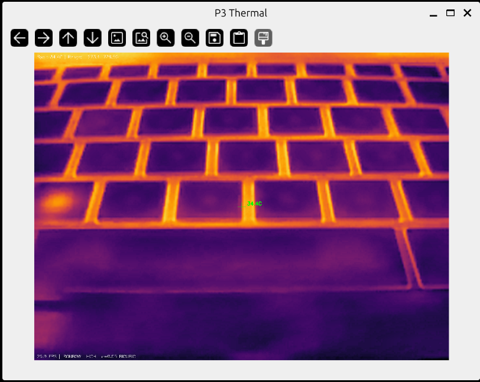
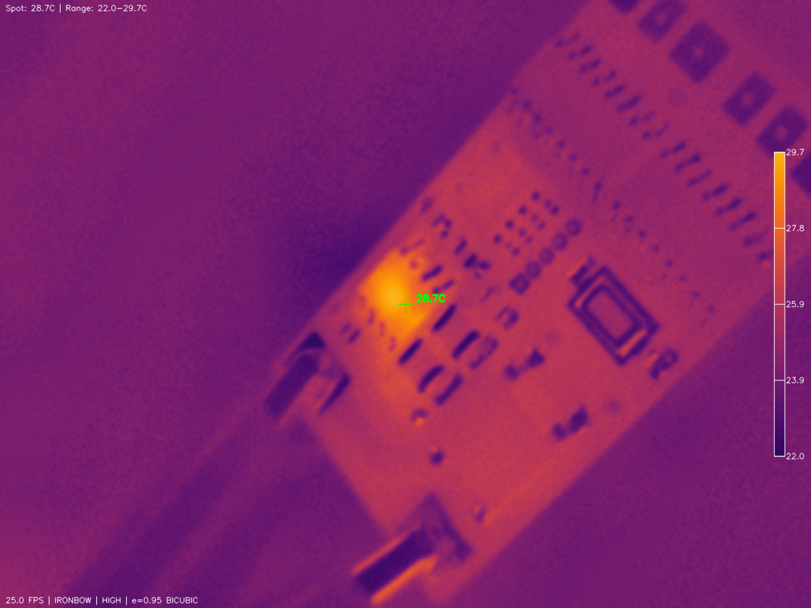

# P3 IR Camera

Python driver and viewer for P3-series USB thermal cameras.  Improved? with lock-in thermography function.  See lock-in.md




Images courtesy of [jvdillon](https://github.com/jvdillon) and
[huberbenno](https://github.com/huberbenno)
([PR#11](https://github.com/jvdillon/p3-ir-camera/pull/11)).


**Devices**:

- P1: VID=0x3474, PID=0x45C2, 160×120 native resolution
- P3: VID=0x3474, PID=0x45A2, 256×192 native resolution

> **Disclaimer**: This is an independent open-source project. It is not
> affiliated with, endorsed by, or connected to any camera manufacturer.
> Protocol details were determined through USB traffic analysis and
> experimentation.

## Features

- USB driver for frame capture and device control
- Real-time thermal viewer with multiple colormaps
- Temperature measurement at cursor position
- Temporal noise reduction and digital detail enhancement
- Multiple AGC modes (factory hardware AGC, temporal percentile, fixed range)
- Shutter/NUC calibration control
- High/Low gain mode switching
- Rudimentary lock-in thermography for finding very small temperature changes

## Installation

```bash
git clone https://github.com/jvdillon/p3-ir-camera
cd p3-ir-camera
pip install -e .
```

### USB Permissions (Linux)

Create a udev rule to allow non-root access:

```bash
sudo tee /etc/udev/rules.d/99-p3-ir.rules << EOF
# P1 camera
SUBSYSTEM=="usb", ATTR{idVendor}=="3474", ATTR{idProduct}=="45c2", MODE="0666"
# P3 camera
SUBSYSTEM=="usb", ATTR{idVendor}=="3474", ATTR{idProduct}=="45a2", MODE="0666"
EOF
sudo udevadm control --reload-rules
sudo udevadm trigger
```

### USB Driver (Windows)

pyusb requires a libusb-compatible driver. Use [Zadig](https://zadig.akeo.ie/):

1. Download and run Zadig
2. Options → List All Devices
3. Select the camera (VID 3474, PID 45C2 for P1 or 45A2 for P3)
4. Select **WinUSB** driver
5. Click "Replace Driver"

## Usage

### Viewer

```bash
# Use P3 camera (default, 256×192)
p3-viewer

# Use P1 camera (160×120)
p3-viewer --model=p1

# Use P3 camera explicitly
p3-viewer --model=p3

# Lock-in thermography - press 'l' once viewer is open
p3-viewer --frequency 0.1 --integration 120
```

**Controls:**

- `q` - Quit
- `h` - Toggle help overlay
- `c` - Cycle colormap
- `a` - Cycle AGC mode
- `d` - Toggle DDE (detail enhancement)
- `p` - Toggle enhanced mode (CLAHE + DDE)
- `x` - Cycle scale/interpolation mode
- `t` - Toggle reticule
- `s` - Trigger shutter/NUC
- `g` - Toggle gain mode (high/low)
- `r` - Rotate display 90°
- `m` - Mirror display
- `+`/`-` - Zoom in/out
- `e` - Cycle emissivity presets
- `1-9` - Set emissivity (0.1-0.9)
- `D` - Dump raw thermal data to file
- `Space` - Screenshot
- `l` - Activate lock-in thermography (see lock-in.md)
- `b` - Toggle min/max spot marker
- `v` - Toggle colorbar

### Library

```python
from p3_camera import Model, P3Camera, get_model_config, raw_to_celsius

# Use P3 camera (default)
camera = P3Camera()
# Or use P1 camera
# camera = P3Camera(config=get_model_config(Model.P1))

camera.connect()
camera.init()
camera.start_streaming()

ir_brightness, thermal_raw = camera.read_frame_both()
temps_celsius = raw_to_celsius(thermal_raw)

# Center coordinates depend on model
# P1: (59, 80), P3: (95, 128)
print(f"Center temp: {temps_celsius[temps_celsius.shape[0]//2, temps_celsius.shape[1]//2]:.1f}C")

camera.stop_streaming()
camera.disconnect()
```

## Protocol Documentation

See [P3_PROTOCOL.md](P3_PROTOCOL.md) for USB protocol details.

## Contributing

This project provides initial scaffolding for a P3 thermal camera application.
There's significant potential to build something great here, and contributions
are welcome!

Some areas that could use help:

- **macOS support** - USB handling on macOS
- **GUI application** - Qt/GTK interface beyond the OpenCV viewer
- **Recording/playback** - Video capture with thermal data preservation
- **Radiometric analysis** - Region statistics, spot meters, isotherms
- **Calibration tools** - Blackbody calibration, emissivity tables
- **Documentation** - Protocol details, hardware information

If you have a P3 camera and want to help improve this tool, PRs are welcome!

## License

Apache 2.0
